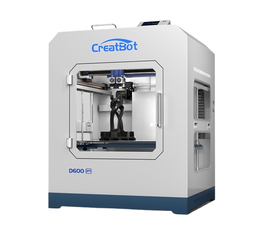

# CreatBot D600 Pro Info
CreatBot D600 Pro - Processes, Troubleshooting, and Parts Info

[Official Website](https://www.creatbot.com/en/creatbot-d600.html)

The reason for this documentation is to keep track of all the troubleshooting steps that were needed to fix an issue of the Z-axis of our printer not working.

## [How To start a 3D Print](/How To Print/HowToPrint.md)
## [Hardware Info](/Hardware Info/HardwareInfo.md)

### Reference and layout credits:

[kForth CreatBot-F430-Info](https://github.com/kForth/CreatBot-F430-Info)

[CreativeInquiry 3d-printers](https://github.com/CreativeInquiry/3d-printers)